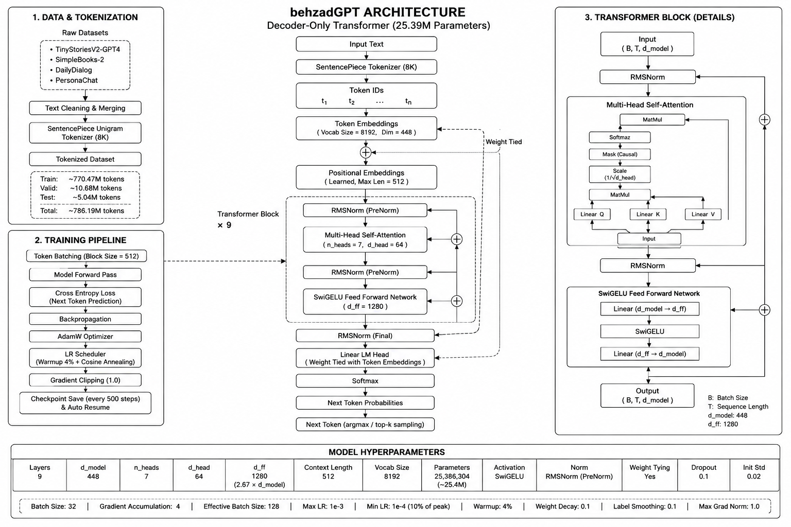
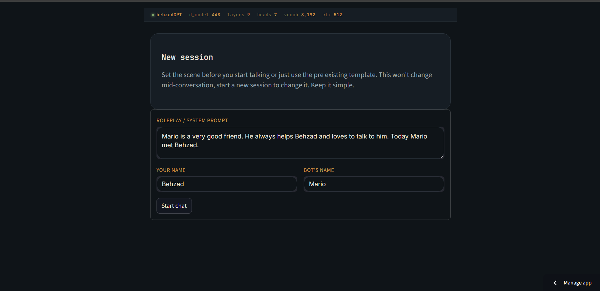
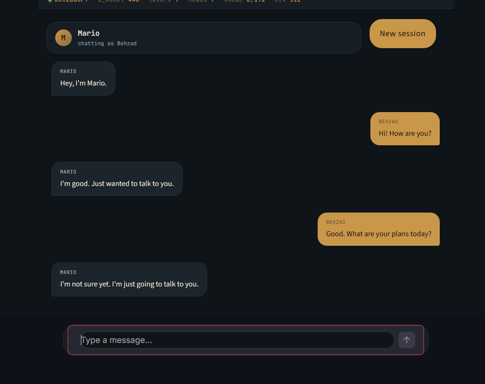
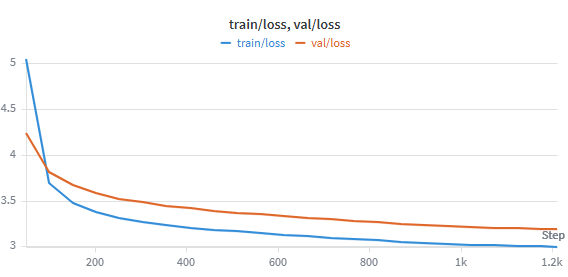
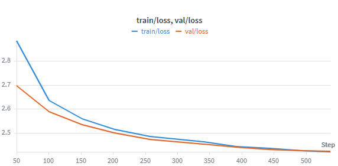

# behzadGPT

A **26.4M parameter decoder-only Transformer** trained completely from scratch for conversational English generation.

The project includes everything from data preprocessing, tokenizer training, model implementation, pretraining, supervised fine-tuning, checkpoint recovery, inference, and deployment.

Unlike projects that only fine-tune existing LLMs, this model was designed and trained entirely from scratch as a university learning project. Consider this model a 5 year old child only. As this model only has 25 million parameters and a very short context window (a few lines), don't compare its performance with the modern LLMs, they have billions or trillions of parameters and spend a lot of money on training resources while I used free small ones.


---

## Demo

**Live Demo**

https://behzadgpt.streamlit.app/

**GitHub**

https://github.com/notBehzad/behzadGPT

**Weights & Biases**

https://wandb.ai/not_behzad/behzadGPT/workspace

---

## Features

- 26.4 Million parameter Transformer
- Built entirely from scratch using PyTorch
- SentencePiece Unigram tokenizer
- Decoder-only GPT architecture
- SwiGELU Feed Forward Network
- RoPE positional embeddings
- RMSNorm (PreNorm)
- Weight-tied embeddings
- Multi-Head Self Attention
- Linear Warmup + Cosine LR Scheduler
- Automatic checkpoint recovery
- Resume-safe shuffled dataloader
- Supervised conversational fine-tuning
- Streamlit ChatGPT-style interface

---

# Model Architecture

| Component | Value |
|------------|------:|
| Parameters | 26.39M |
| Layers | 9 |
| Hidden Size | 448 |
| FFN Size | 1280 |
| Attention Heads | 7 |
| Head Dimension | 64 |
| Context Length | 512 |
| Vocabulary Size | 8192 |
| Activation | SwiGELU |
| Normalization | RMSNorm (PreNorm) |
| Weight Tying | Yes |

Approximate parameter count:

```
(4 × depth × d_model²)
+ (depth × 3 × d_model × d_ff)
+ (vocab × d_model)
+ (2 × d_model × depth)

= 26,386,304 parameters
```

---

# Why these Design Choices?

Rather than copying GPT configurations directly, the architecture was designed by studying scaling laws and parameter tradeoffs.

## Model Size

The model intentionally targets **~25M parameters**.

The goal was not to compete with modern LLMs, but to maximize performance within a realistic student training budget while keeping inference efficient.

---

## Token-to-Parameter Ratio

Approximately **1.1 billion tokens** were used across pretraining and fine-tuning.

Pretraining alone used approximately **800M tokens**, giving a ratio close to **40 tokens per parameter**.

Although Chinchilla scaling suggests roughly 20:1, this project intentionally traded additional compute for better performance from a relatively small model.

---

## Width vs Depth

```
Hidden Size : 448
Layers      : 9
Width/Depth Ratio ≈ 50
```

Small models benefit from a relatively balanced architecture.

Very wide shallow models struggle with abstraction, while extremely deep narrow models become difficult to optimize.

---

## Attention Heads

```
Heads = 7
Head Dimension = 64
```

Empirical observations across many transformer models show head dimensions typically lie between **64–128**.

Choosing **64** allows:

- More attention heads
- Enough representational capacity per head
- Better concept specialization for a compact model

---

## Feed Forward Network

Instead of the traditional

```
4 × d_model
```

projection,

SwiGELU was used.

SwiGELU requires **three projection matrices instead of two**, so the intermediate dimension was reduced to

```
2.67 × d_model
```

to maintain approximately the same parameter count as the conventional 4× FFN.

This generally provides better optimization and lower loss under the same parameter budget.

---

## Vocabulary Size

Vocabulary size was intentionally limited to

```
8192 tokens
```

A larger vocabulary would significantly increase embedding parameters.

With an 8K vocabulary:

- Embeddings occupy approximately **14.5%** of total parameters.
- Untied embeddings would consume nearly **29%**, leaving much less capacity for the transformer itself.

For this reason, **input and output embeddings are weight tied**.

---

## Context Length

Context Length = **512**

Attention complexity grows quadratically with sequence length.

Because the tokenizer uses a relatively small vocabulary (leading to a higher token-to-word ratio), increasing context from 256 to 512 provides noticeably better usable context while remaining computationally feasible.

---

# Tokenizer

Two tokenizer families were explored.

## Byte Pair Encoding (BPE)

Vocabulary Size

```
8192
```

Special Tokens

```
<EOS>
<UNK>
<PAD>
<EOT>
```

Training

- Batch Size: 1000
- Minimum Frequency: 2

Dataset

| Split | Tokens |
|-------|-------:|
| Train | 797,607,407 |
| Validation | 11,037,233 |
| Total | 808,644,640 |

---

## SentencePiece Unigram (Selected)

SentencePiece produced better downstream performance and was therefore selected.

Configuration

```
character_coverage = 0.9995
byte_fallback = True
input_sentence_size = 2,000,000
shuffle_input_sentence = True
```

Dataset

| Split | Tokens |
|-------|-------:|
| Train | 770,472,759 |
| Validation | 10,682,696 |
| Test | 5,035,768 |
| Total | 786,191,223 |

---

# Training Data

The pretraining corpus consists of

- TinyStoriesV2-GPT4
- SimpleBooks-2
- DailyDialog
- PersonaChat

---

# Training Configuration

```python
Batch Size            : 32
Gradient Accumulation : 4
Effective Batch Size  : 128

Learning Rate         : 1e-3
Weight Decay          : 0.1
Label Smoothing       : 0.1

Warmup                : 4%
Scheduler             : Cosine Annealing

Gradient Clipping     : 1.0

Initialization        : Normal(std=0.02)
```

Additional improvements

- Residual variance scaling
- Automatic checkpointing every 500 steps
- Automatic resume from latest checkpoint
- Resume-safe dataloader shuffling

---

# Fine-Tuning

Dataset

```
allenai/SODA
```

Approximately

```
300 Million tokens
```

Only the target speaker contributes to the loss.

Non-target responses are masked using

```python
ignore_index = -100
```

This teaches the model to generate responses instead of reproducing entire conversations.

Inference uses

```
Top-k = 4
```

The deployed chatbot also includes:

- System prompt
- Scenario prompt
- Character name
- User name

to maintain conversational consistency.

---

# Results

## Pretraining

| Metric | Value |
|---------|------:|
| Train Loss | 2.99 |
| Validation Loss | 3.19 |
| Train Perplexity | 19.9 |
| Validation Perplexity | 24.3 |

---

## Fine-Tuning

| Metric | Value |
|---------|------:|
| Train Loss | 2.420 |
| Validation Loss | 2.421 |
| Train Perplexity | 11.25 |
| Validation Perplexity | 11.26 |

---

# Training Curves







> **Note**
>
> During training the runtime disconnected several times.
> Automatic checkpoint recovery successfully resumed training without repeating progress.
>
> A small oversight in the resume logging logic caused one incorrect logged value, producing a visible spike in some Weights & Biases graphs (around the middle and end of `loss_fast`). This affects visualization only—the actual training remained uninterrupted.

---

# Project Structure

```
├── codes/
│   ├── fine_tune.py
│   ├── process_fine_tuning_dataset.py
│   ├── process_training_dataset.py
│   └── train.py
│
├── dataset/
│   ├── train/
│   └── validation/
│
├── model/
│   ├── model_raw.pth
│   └── model.pth
│
├── tokenizer/
│   ├── unigram_8k.model
│   └── unigram_8k.vocab
│
├── app.py
├── model_def.py
├── requirements.txt
```

---

# Running

```bash
git clone https://github.com/notBehzad/behzadGPT

cd behzadGPT

pip install -r requirements.txt

streamlit run app.py
```

---

# Acknowledgements

Most of the machine learning implementation—including tokenizer training, data processing, model architecture, pretraining, fine-tuning, inference, and deployment pipeline—was implemented by me as the primary focus of this project.

Additional contributions include:

- **Claude** — Front-end implementation for the Streamlit interface.
- **Gemini** — Small assistance with resume-safe DataLoader shuffling logic.

---
